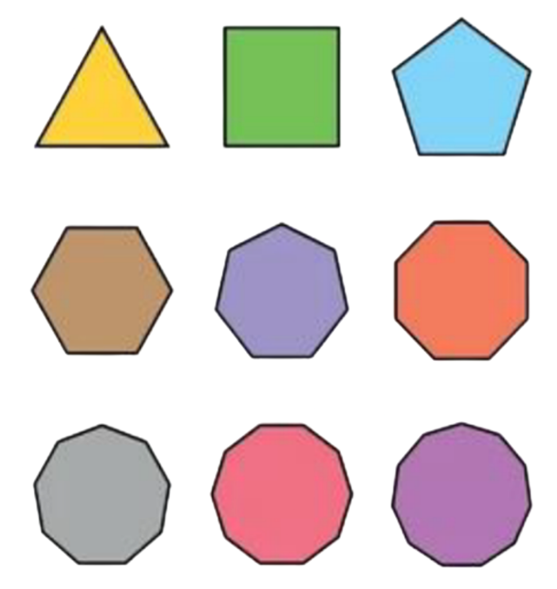
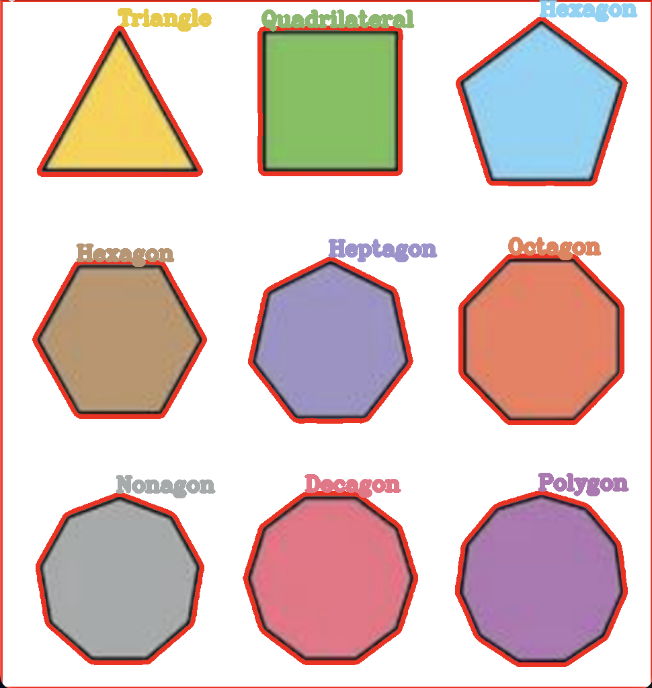

# Shape And Color Detection Using OpenCV
This program helps in detecting the shape and color of objects show to it through a picture using the python library *OpenCV*

Developed by Harshdeep Singh &copy; 2023

## Implementation Of Code
### Input -
We are provided with shapes with different colors and sizes as shown below



### Main Logic and Processing -

#### Shape Detection :
The Main Logic for shape detection is we have to get the number of *contours* in the shape to detect that particular polygon's name as if 3 contours it will be triangle and so on.

Therefore to get the number of *contours*, we have to first convert the image to *grayscale* image by using the ```cv2.cvtColor(img, cv2.COLOR_BGR2GRAY)``` then *thresholding* it to get better *contours* using ```cv2.threshold(grayscaled_Img, limit, maxVal, Technique)``` and looped through the *contours* after finding them using ```cv2.findContours(threshed_Img, retrieval_mode, approximation_mode)``` and finally after drawing those *contours* we get the number of *contours*. We have also used ```cv2.approxPolyDP()``` to test them as a polygon, So finally we get the number of contours to check whether it's a triangle or rectangle or anything else.

#### Color Detection: 
As we get the coordinates of the name of shape, we can alter those coordinates to get the rgb's values of the shapes to get the color, so now we have got the color as well shape of the polygon.

Now We just ```putText()``` to the image for each polygon in their respective colors. 

### Output -
After doing this much we get a clean image having the names and colors of the shape along with them.

